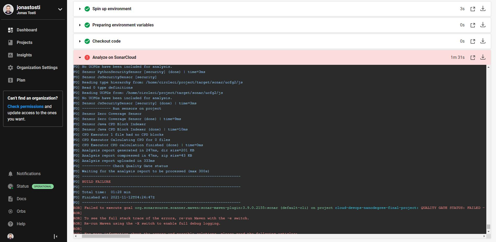
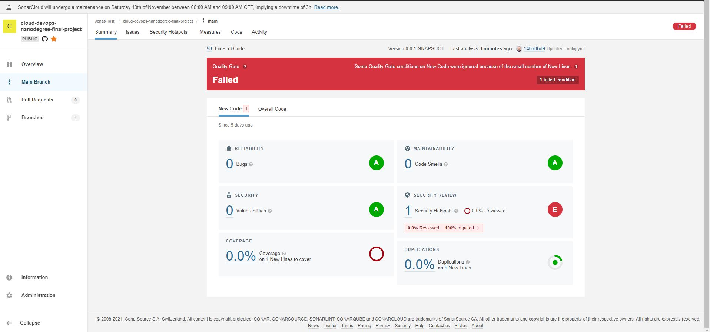
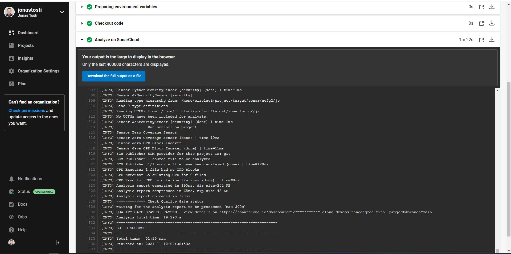
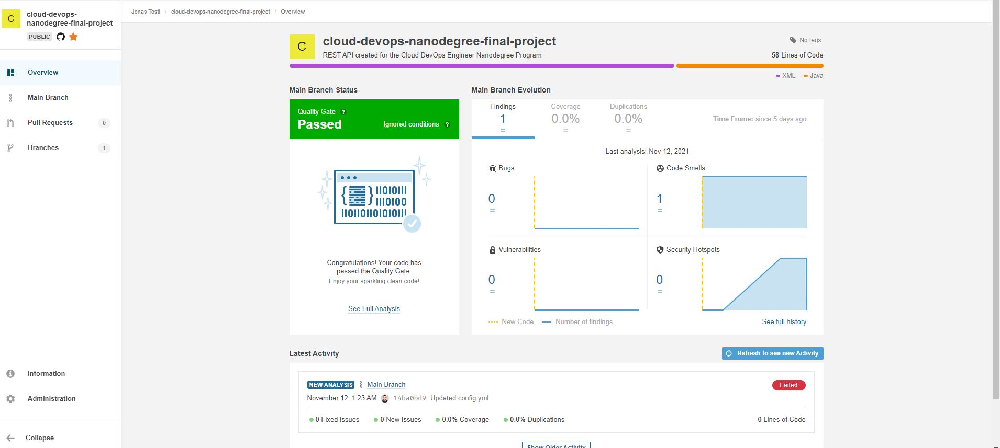
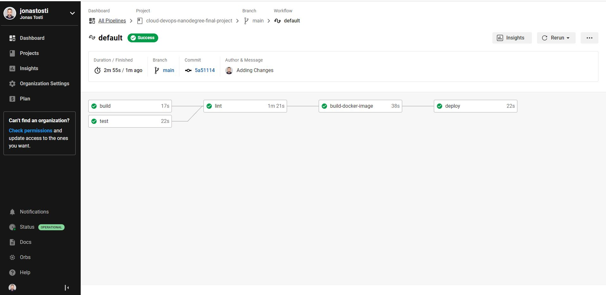
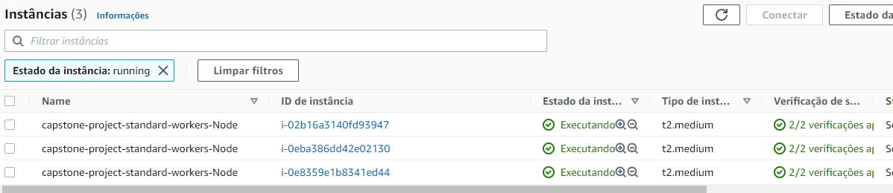
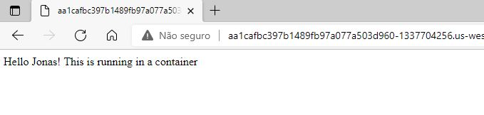
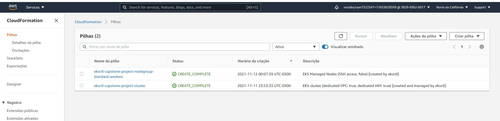

# Project Overview

This repo is part of the Capstone Project from the Cloud DevOps Engineer Nano-degree program from Udacity. The goal of this project was to develop a CI/CD Pipeline for a Rest API.

### API

Simple API created with SpringBoot. It only prints a Hello Jonas message.

### Pipeline

## Screenshots

### Lint

The Linting was made using SonarCloud.

#### Failure example

#### Success example

### Deploy

### Cloud Formation

